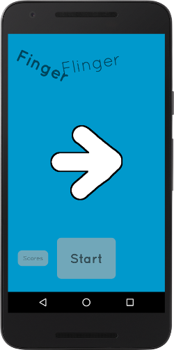
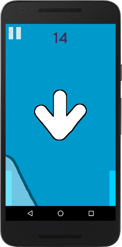
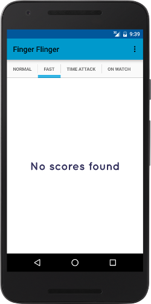
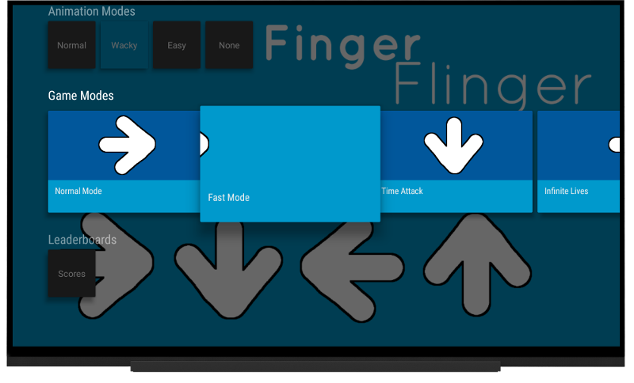
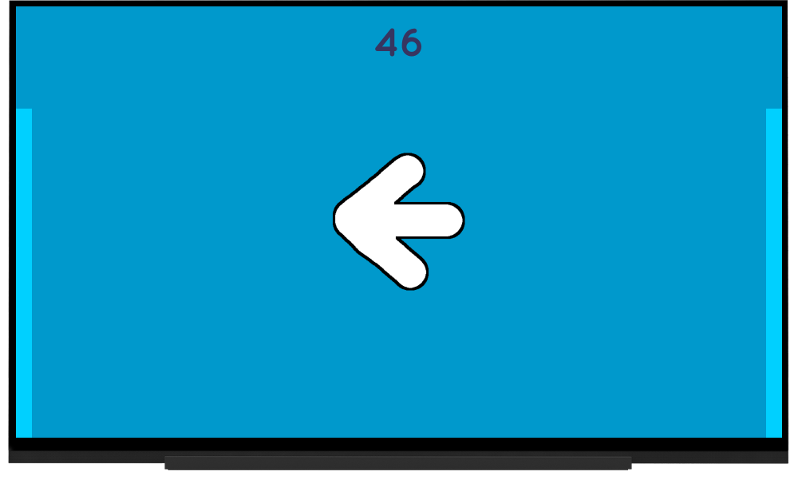
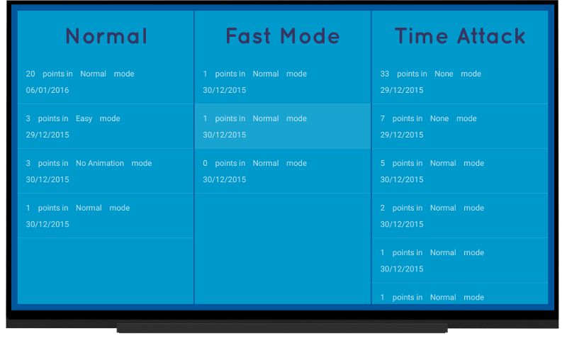
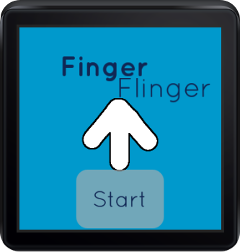

# Finger Flinger

Finger flinger is a simple Android gesture detection game for mobile, Android wear, and Android TV built entirely with the native Android framework.

The game involves swiping in the direction of the arrow that appears before time runs out.  Time decreases each time an arrow is swiped.

There are four game modes: Normal, Fast Mode (less time), Time Attack (swipe as many arrows in one minute), and Infinite Lives.

There are four arrow animation modes: Normal (arrows fade in and slide out in the direction they are swiped), Easy mode (arrows slide in the direction they are pointing), Wacky mode (random in and out animations), and No Animations.

## Screenshots:

#### Phone main menu, in-game, and leaderboard:

#### TV main menu, in-game, and leaderboard:

#### Wear main menu and in-game:

#### When a mobile device detects a connected watch with the game, it will give the option to open the game on the watch:

